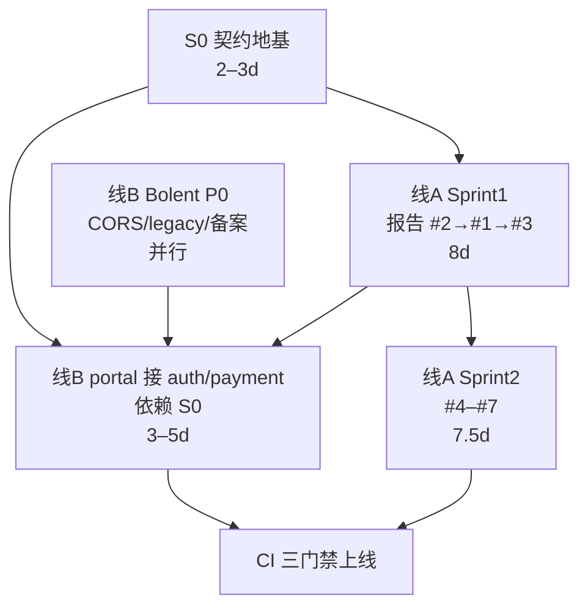

# 一致性整改 × 双仓交付 协同方案（专家研判稿）

> **版本：** 1.0 · **日期：** 2026-07-03  
> **状态：** 待专家团队 Review · **尚未立项执行**  
> **编制依据：**  
> - [CONSISTENCY_REMEDIATION_REPORT.md](./CONSISTENCY_REMEDIATION_REPORT.md) — looma 前端四端（planetx / saas / miniprogram / shared-core）  
> - [looma-zervi/docs/DUAL_REPO_WORK_GUIDE.md](./looma-zervi/docs/DUAL_REPO_WORK_GUIDE.md) — looma × szbolent-portal 双仓协作  
> - [looma-zervi/docs/PROJECTS_DIRECTORY_AUDIT.md](./looma-zervi/docs/PROJECTS_DIRECTORY_AUDIT.md) — Projects 目录勘查  
> **受众：** 专家评审组、looma 前端组、portal 组、后端组、产品/合规  
> **目的：** 将两条并行工作线对齐，避免 Bolent 商业闭环与前端架构债相互放大，形成可排期、可验收的协同方案

---

## 1. 执行摘要

近期两项独立审查分别发现：

| 审查线 | 范围 | 核心发现 |
|--------|------|----------|
| **线 A** | looma-zervi 前端四端 | 小程序未接 shared-core；题库/合规/API 多处手工镜像（9 项，见整改报告） |
| **线 B** | looma-zervi × szbolent-portal | portal `poetry.ts` 手写契约；`looma.ts` 待建；文档双份 sync；legacy `:8001` 残留 |

**研判结论（供专家确认）：** 两条线 **根因相同** —— 缺少统一的 **契约真源（Single Source of Truth）** 与 **变更门禁**，各端/各仓在并行开发中通过「复制粘贴」规避共享成本，累积一致性隐患与合规风险。

**协同方案要点：**

1. 新增 **阶段 S0（契约地基）**，优先于 portal 大规模手写 `looma.ts` 与 looma 四端继续扩面。  
2. looma 内部按整改报告 **Sprint 1→2** 推进；portal Bolent **P0** 与 Sprint 1 **并行但受 S0 约束**。  
3. 建立 **三门禁 + CI**，将 szbolent-portal 列为第五 **消费端**（非 UI 统一对象）。  
4. 需专家拍板 **3 项架构决策**（§8）后，再正式立项与排期。

**预估不新增重大架构变更**；主要为排期重排、流程补强、契约层提前。

---

## 2. 背景：两条工作线从何而来

### 2.1 线 A — 前端多端一致性整改

- **文档：** `CONSISTENCY_REMEDIATION_REPORT.md`  
- **范围：** `packages/planetx`、`packages/saas`、`packages/miniprogram`、`packages/shared-core`  
- **问题量级：** 9 项；P0 级 3 项（小程序未接 shared-core、题库重复、合规碎片化）；合计 Sprint 1–2 约 **15.5 人天**  
- **目标：** 逻辑/行为/数据一致；**不**统一 planetx 与 saas 视觉品牌

### 2.2 线 B — 双仓商业交付

- **文档：** `DUAL_REPO_WORK_GUIDE.md`、`TENCENT_CLOUD_COMMERCE.md`  
- **范围：** `looma-zervi`（API + 小程序 + React 前端）+ `szbolent-portal`（Vue 门户）+ WordPress（第三服务）  
- **P0 重点：** CORS、备案、`api.genz.ltd`、portal 对接 Looma auth/payment、清理 legacy `:8001`  
- **P2 目标：** `@looma/api-contract`、OpenAPI、双仓文档 CI diff

### 2.3 为何必须协同

若两条线 **独立排期、互不约束**，已识别的高风险包括：

| 场景 | 后果 |
|------|------|
| portal 先手写完整 `looma.ts` + auth/compliance 类型 | Sprint 2 抽契约时需 **第三次** 重写 |
| 小程序仍独立维护 JWT/consent | 直连 `api.genz.ltd` 后与 Web 端 tier/consent 行为不一致 |
| portal 继续扩展 `poetry.ts` adapter 字段 | backend / shared-core / portal **三处 drift** |
| 仅做线 B 清 legacy、不做线 A #3 | 门户登录若复制 consent 枚举，**合规遗漏风险重演** |

---

## 3. 根因分析（统一模型）

```text
                    ┌─────────────────────────┐
                    │   契约真源（缺失/滞后）    │
                    │ shared-core · OpenAPI   │
                    │ backend contracts/      │
                    └───────────┬─────────────┘
                                │
        ┌───────────────────────┼───────────────────────┐
        ▼                       ▼                       ▼
  miniprogram/            planetx / saas         szbolent-portal/
  types 手工镜像          部分已 import           poetry.ts 手写
  consent 硬编码          题库仍本地一份           looma.ts 待手写
  MiniApiClient 自实现    API Client 已封装        无 shared 依赖
```

| 根因 | 表现 | 涉及线 |
|------|------|--------|
| **R1** 契约层晚于业务层 | 各端先上线，后抽 shared-core | A |
| **R2** 平台差异被过度解读 | 「小程序不能用 npm」→ 长期手工复制 | A |
| **R3** 跨框架未抽框架无关包 | Vue portal 与 React monorepo 分离 → 再写一遍 types | B |
| **R4** 无 CI 拦截镜像代码 | diff 靠人工；文档靠「必须 sync」自觉 | A + B |
| **R5** 合规/常量无变更门禁 | 新增 ConsentScope 易漏小程序或 portal | A + B |

---

## 4. 协同原则（建议专家采纳）

| # | 原则 | 说明 |
|---|------|------|
| P1 | **契约先行** | 类型、枚举、API 路径、ConsentScope、JWT 键名 — 先改真源，再改消费端 adapter |
| P2 | **门户是消费端，不是第二后端** | szbolent-portal 只 HTTP 调 Looma；禁止 portal 内定义与 backend 重复的 domain 类型 |
| P3 | **视觉可分叉，行为须对齐** | planetx / saas / portal UI 各异；超时、401、token、consent 须一致 |
| P4 | **S0 阻塞 portal auth 扩面** | CORS、静态页、清 legacy 可并行；**大规模 looma.ts 类型定义** 等 S0 |
| P5 | **shared-core 变更双人 Review** | 延续整改报告 §5；portal 消费契约时 looma 前端 Owner 必审 |
| P6 | **文档与代码同门禁** | 双仓 sync 文档 + 契约文件纳入 CI diff |

---

## 5. 统一阶段路线图



### S0 — 契约地基（新增，优先立项）

| 任务 | 负责 | 产出 | 预估 |
|------|------|------|------|
| S0-1 | 后端 | `contracts/poetry.v1.json` 或 OpenAPI 诗词段 | 1d |
| S0-2 | 后端 | auth / payment / compliance 路由 schema 纳入同一 OpenAPI | 1d |
| S0-3 | 前端 | shared-core 补导出：题库、personality、IDENTITY_LABELS、getRankName（报告 #1/#2 前置） | 1d |
| S0-4 | 架构 | 确定 `@looma/api-contract` 包边界（见 §8 决策 1） | 0.5d |

**S0 完成定义：** 存在可版本化的契约文件；portal 与 miniprogram 新代码 **仅允许 import**，禁止新增镜像 enum/接口。

---

### 线 A — 按整改报告执行（微调依赖）

| 阶段 | 内容 | 工时 | 与 S0 / 线 B 关系 |
|------|------|------|-------------------|
| Sprint 1 | #2 题库→shared-core → #1 小程序 npm → #3 合规 | 8d | #2 与 S0-3 合并；#3 完成后 portal consent 可复用 |
| Sprint 2 | #5 Token → #6 组件逻辑 → #7 AuthGuard → #4 API Client | 7.5d | #4 超时 30s 为 portal 门禁基准 |
| Sprint 3 | #8 #9 按需 | TBD | 产品决策后 |

**不建议调整** 整改报告内的技术方案；**建议调整** 仅 **启动顺序与 portal 接入时点**。

---

### 线 B — Bolent P0（与 S0/Sprint1 并行）

| 任务 | 可否与 S0 并行 | 说明 |
|------|----------------|------|
| P0-L* CORS、health、Nginx | ✅ | 不依赖契约包 |
| P0-P4 清 `:8001` proxy | ✅ | 降低双后端风险 |
| P0-P7 legal 静态页 | ✅ | |
| P0-P2 `looma.ts` **完整类型手写** | ❌ 建议等 S0 | 仅可先写 fetch 薄封装 + import types |
| P0-P3 Pricing / 登录页 UI | ⚠️ 部分 | UI 可 mock；接真实 API 等 S0 + #3 |
| `poetry.ts` 新字段 | ⚠️ | 仅 bugfix；新字段必须来自 contracts |

---

## 6. 团队分工与协同节奏

### 6.1 RACI 简表

| 工作包 | looma 前端 | portal | 后端 | 专家/架构 |
|--------|------------|--------|------|-----------|
| S0 契约 | C | I | R | A |
| 报告 Sprint 1–2 | R | I | C | A（门禁规则） |
| Bolent P0 基础设施 | C | R | R | I |
| portal looma.ts / Pricing | C | R | C | A |
| CI 三门禁 | C | C | C | A |
| 双仓文档 sync | C | C | — | I |

*R=执行 A=审批 C=协商 I=知会*

### 6.2 建议双周协同日历

| 周 | looma 前端 | portal | 后端 | 联合验收 |
|----|------------|--------|------|----------|
| W1 | S0-3 + 报告 #2 题库 | CORS；清 `:8001` | S0-1/2 OpenAPI；CORS 生产配置 | `curl poetry` + `verify-closed-loop` |
| W2 | 报告 #1 小程序 shared-core | `looma.ts` 薄封装（仅 import 契约） | `/v1/poetry/authors` RFC | 小程序 splash→hub |
| W3 | 报告 #3 合规 | Pricing 页接 API（契约 types） | 支付 P1 路由 | portal /poetry E2E |
| W4+ | Sprint 2 | 备案 checklist 收尾 | 部署 | 全链路 smoke |

### 6.3 站会议题（30min / 双周）

1. shared-core / contracts 变更清单（breaking or not）  
2. portal adapter PR 是否仅改映射层  
3. P0 checklist 与 Sprint 完成度  
4. 合规 scope 是否有新增（影响全端）  

---

## 7. 防复发：三门禁（建议写入治理文档）

### 门禁 G1 — 类型与常量单真源

**规则：** 新增/修改 `User`、`Tier`、`ConsentScope`、`QUIZ_QUESTIONS`、API path 等，**必须先 PR** 至 `shared-core` 或 `backend/contracts/`，禁止在以下路径 **新增** 定义：

- `miniprogram/types/index.ts`（仅保留 `AppEvent` 等平台特有类型）  
- `planetxAuthStore.ts` 内联常量  
- `szbolent-portal/src/api/poetry.ts` 内 Looma 响应 struct  
- `szbolent-portal/src/api/looma.ts` 手写 duplicate types  

**CI（P1）：** grep / ast 检测重复 enum 名；OpenAPI diff。

### 门禁 G2 — API 行为对齐

| 项 | 统一值 | 消费端 |
|----|--------|--------|
| HTTP 超时 | 30000ms | planetx、saas、miniprogram、portal axios |
| 401 | 清 token → 跳登录 / emit auth:expired | 全端 |
| JWT localStorage key | `looma_token` | Web + portal（报告 P1-15） |
| ConsentScope | `shared-core/types/compliance.ts` | 全端含小程序 wx.showModal |

### 门禁 G3 — 文档与契约同步

| 文档/产物 | 同步要求 |
|-----------|----------|
| `DUAL_REPO_WORK_GUIDE.md` | 双仓同文 |
| `TENCENT_CLOUD_COMMERCE.md` | 双仓同文 |
| `CONSISTENCY_REMEDIATION_REPORT.md` | looma 仓维护；完成项打勾 |
| OpenAPI / contracts | 变更必须带 portal + miniprogram 影响说明 |

---

## 8. 提请专家研判的三项决策

> **请专家组对下列选项勾选或补充意见；未决前不建议 portal 大规模手写 auth/compliance 类型。**

### 决策 1：契约包如何拆分？

| 选项 | 内容 | 优点 | 缺点 |
|------|------|------|------|
| **A（推荐）** | `shared-core` = 行为/类型/合规/题库；`contracts/`（OpenAPI/JSON）= HTTP 路由；`@looma/api-contract` = 从 OpenAPI 生成的纯 TS types 供 portal | 职责清晰；portal 零 React 依赖 | 需维护 codegen 流水线 |
| B | 全部扩进 shared-core，portal 通过 npm 引 workspace | 实现简单 | shared-core 膨胀；小程序 npm 构建压力 |
| C | 仅 OpenAPI，portal 手写 adapter 对照 yaml | 无新包 | portal 仍易 drift |

**推荐 A**；S0 周期内落地最小可行（poetry + auth 段）。

### 决策 2：szbolent-portal 是否纳入「一致性治理」范围？

| 选项 | 说明 |
|------|------|
| **是（推荐）** | portal = 第五消费端；遵守 G1–G3；不纳入 UI/Token 视觉统一 |
| 否 | portal 独立演进 | **不推荐** — 已出现 poetry.ts 镜像模式 |

### 决策 3：S0 与 Bolent P0 的阻塞关系？

| 选项 | 说明 |
|------|------|
| **软阻塞（推荐）** | P0 基础设施并行；**looma.ts 类型定义 / Pricing 接真实 consent** 等 S0 |
| 硬阻塞 | 全部 Bolent P0 等 Sprint 1 完成 | 备案窗口可能延误 |
| 无阻塞 | 双线完全独立 | **不推荐** — 重复整改 |

---

## 9. 风险与缓解

| 风险 | 影响 | 缓解 |
|------|------|------|
| S0 拉长 Bolent 上线 | 商业进度 | 软阻塞：仅延迟 auth 类型手写；CORS/诗词/静态页照常 |
| 小程序 npm 构建失败 | Sprint 1 延期 | 分模块 PR；shared-core 产出 .js 备用 |
| 专家决策滞后 | 排期悬空 | 默认采用本文 **推荐项** 作 2 周临时基线 |
| portal 与 looma 文档 drift | 联调误解 | CI diff + 站会第一项 |
| 合规 scope 新增 | 法律风险 | G1 + 后端先发 scope → 全端同一 PR 周期 |

---

## 10. 验收与里程碑

| 里程碑 | 标志 | 目标时间（待专家确认） |
|--------|------|------------------------|
| M0 | 专家对本稿 §8 三项决策书面确认 | T+3 工作日 |
| M1 | S0 完成：OpenAPI + shared-core 导出就绪 | W1 末 |
| M2 | 报告 Sprint 1 完成（#1–#3） | W3 末 |
| M3 | Bolent P0 基础设施 + portal 契约化 looma.ts | W3 末 |
| M4 | CI 三门禁首版上线 | W4 |
| M5 | 报告 Sprint 2 + Bolent 支付联调 | W6 |

---

## 11. 附录

### 11.1 文档索引

| 文档 | 路径 | 维护方 |
|------|------|--------|
| 前端多端整改报告 | `Projects/CONSISTENCY_REMEDIATION_REPORT.md` | looma 前端 |
| 本协同方案 | `Projects/CONSISTENCY_CROSS_REPO_SYNERGY_PROPOSAL.md` | 架构/PM |
| 双仓工作指引 | `*/docs/DUAL_REPO_WORK_GUIDE.md` | 双仓 sync |
| Projects 勘查 | `*/docs/PROJECTS_DIRECTORY_AUDIT.md` | 双仓 sync |
| 腾讯云闭环 | `*/docs/TENCENT_CLOUD_COMMERCE.md` | 双仓 sync |

### 11.2 问题对照：报告 9 项 × 线 B

| 报告 # | 线 B 关联 |
|--------|-----------|
| 1 小程序 shared-core | 小程序直连 api.genz.ltd 前必完成 |
| 2 题库 | 与 portal 无直接冲突；优先做 |
| 3 合规 | portal 登录/consent **必须**等 #3 或 S0 |
| 4 API Client | portal axios 应对齐 30s / 401 |
| 5–7 UI/Guard | portal 不纳入 UI 统一；401 规则纳入 G2 |
| 8–9 | 按需；与 Bolent 弱相关 |

### 11.3 专家反馈表（请复制填写）

```text
评审人：__________  日期：__________

决策 1（契约拆分）：  A / B / C / 其他：__________
决策 2（portal 纳入治理）：  是 / 否
决策 3（S0 与 P0 关系）：  软阻塞 / 硬阻塞 / 无阻塞

对路线图意见：
  同意 / 修改：__________

对三门禁意见：
  同意 / 修改：__________

其他意见：


签字：__________
```

---

## 12. 修订记录

| 版本 | 日期 | 说明 |
|------|------|------|
| 1.0 | 2026-07-03 | 初稿：两线对齐协同方案，提请专家研判 |

---

**下一步（研判通过后）：**

1. 将 §8 决策结论写入 `DUAL_REPO_WORK_GUIDE.md` 与 `CONSISTENCY_REMEDIATION_REPORT.md` 头部。  
2. 立项 S0，指定 Owner 与截止日期。  
3. 建立双周站会 + CI 三门禁 backlog。
