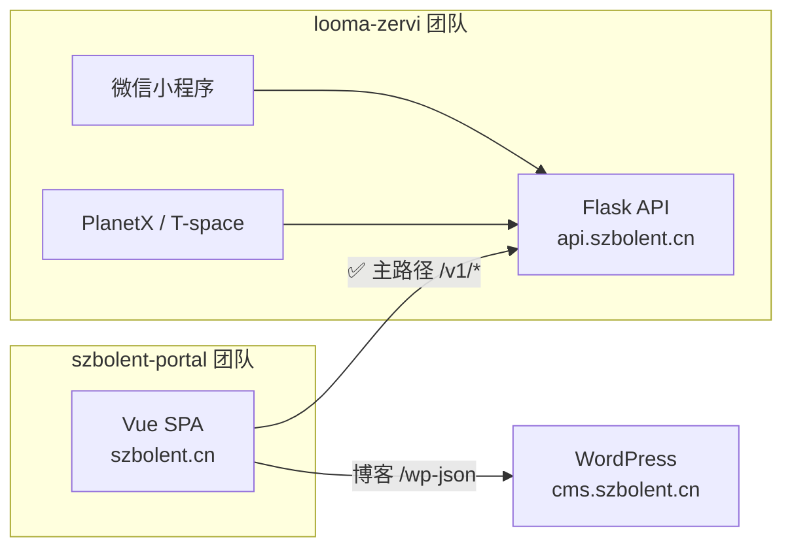

# 双仓协作工作指引（looma-zervi × szbolent-portal）

> **版本：** 1.0 · **日期：** 2026-07-03  
> **同步副本：** 本文档在以下两仓保持 **同文同版**  
> - **平台 / API / 小程序：** `looma-zervi/docs/DUAL_REPO_WORK_GUIDE.md`  
> - **门户壳：** `szbolent-portal/docs/DUAL_REPO_WORK_GUIDE.md`  
> **更新规则：** 任一侧修改分工表、P0 清单或契约说明，**必须同步另一仓**（提交信息注明 `sync: DUAL_REPO_WORK_GUIDE`）  
> **关联文档：**  
> - 备案 / 支付 / 域名：`TENCENT_CLOUD_COMMERCE.md`  
> - 主体选型 / 费用：`COMMERCE_ENTITY_DECISION.md`  
> - 门户集成细节：`szbolent-portal/docs/INTEGRATION.md`  
> - 溯源边界：`szbolent-portal/docs/LINEAGE.md`  
> - **一致性 × 双仓协同（专家研判稿）：** `Projects/CONSISTENCY_CROSS_REPO_SYNERGY_PROPOSAL.md`

---

## 1. 文档目的

本指引供 **looma-zervi 团队**（平台 / API / 小程序 / PlanetX·T-space）与 **szbolent-portal 团队**（`szbolent.cn` 门户壳）在后续迭代中对照执行，确保：

1. 职责边界清晰，避免重复造轮子或改错仓  
2. API 契约变更可追踪、可联调、可验收  
3. Legacy 依赖按计划退役，生产只保留「Looma API + 门户静态 + WordPress（可选）」  
4. 双仓文档与 checklist 不 drift

---

## 2. 架构共识（一句话）

```text
szbolent-portal = 品牌门户壳（Vue SPA，只 HTTP 消费后端）
looma-zervi     = API 真源 + 商业闭环 + 小程序 + PlanetX/T-space 前端
WordPress       = 博客 CMS（第三服务，非双仓代码，但属运行时依赖）
```



**结论：** 双仓拆分 **可行且推荐**，不必合并为单仓。当前重点不是改架构，而是 **收干净 legacy 尾巴、补齐 CORS/商业闭环、建立契约保障**。

---

## 3. 团队分工对照表

| 领域 | looma-zervi 团队 | szbolent-portal 团队 | 协作方式 |
|------|------------------|----------------------|----------|
| **身份 / JWT / tier** | 实现 `/v1/auth/*` | 消费 API，存 token（`looma.ts` 待建） | 契约变更需提前通知 |
| **支付** | 实现 `/v1/payment/*`、微信回调 | Pricing / VIP 页调 API | 共用 `TENCENT_CLOUD_COMMERCE.md` P1 |
| **诗词数据** | SQLite `poems` + ChromaDB；`/v1/poetry/*` | `src/api/poetry.ts` 适配层 | 后端改字段 → portal 同步改 adapter |
| **RAG / AI** | `/v1/ask`、`/v1/poetry/search` | 按需接入；**禁用** `tatha.ts` | 不部署独立 Tatha :8010 |
| **静态门户** | — | `npm run build` → CDN/Nginx | portal 团队独立部署 |
| **小程序** | miniprogram + CloudBase 过渡 | 不使用 CloudBase | 合法域名就绪后直连 API |
| **博客** | — | `wordpress.ts` + WP 运维 | 第三服务，portal 只读 REST |
| **企业页 / 服务 / 案例** | 暂无 Looma 路由 | 当前 **静态数据**；`business.ts` 为 legacy | 见 §6.1 退役计划 |
| **活动抽奖** | 暂无 Looma 路由 | `activity.ts` → legacy :8001 | 见 §6.1 退役计划 |
| **合规 / 备案** | API 域、支付回调、CORS | 门户域、隐私页 URL | 同主体、同 checklist |
| **烟雾测试** | `scripts/verify-closed-loop.sh` 等 | 联调后补充 portal 路径 | 共用 `API_BASE` 环境变量 |

### 3.1 Ownership 速查（looma 内部）

| 包 / 路由 | Owner |
|-----------|-------|
| `packages/planetx` + `/v1/game/*` | Jason |
| `packages/saas` + `/v1/enterprise/*` | szbenyx |
| `packages/shared-core` + `/v1/auth/*` | 联合 review |
| `packages/miniprogram` | Jason |
| `/v1/poetry/*` | Jason |
| `/v1/jobs/*`, `/v1/ask`, `/v1/resume/*`, `/v1/reports/*` | szbenyx |
| `/v1/referral/*` | Jason |

**Bolent 门户不直接改 looma 前端 monorepo**；诗词相关后端变更由 Jason 牵头，portal 团队 review adapter 影响。

---

## 4. 边界规则（勿混淆）

| ❌ 不要 | ✅ 应该 |
|--------|--------|
| 在 SurfaceZervi 根目录再开 Bolent 代码副本 | 只在 `szbolent-portal` 与 `Poetry-modown` 改门户代码 |
| 门户直连 SQLite / ChromaDB | 只 HTTP 调 Looma `/v1/*` |
| 生产启用 `VITE_TATHA_POETRY_ENABLED=true` | RAG 走 Looma `/v1/ask` 与 `/v1/poetry/search` |
| 部署 legacy bolent Sanic `:8001` 作为诗词源 | 诗词走 Looma `/v1/poetry/*` |
| 把 Bolent 写进 JobFirst 首屏 | 叙事线 `bolent-content` 与求职主线分离 |
| 在 portal 复制一份 React `shared-core` | 抽框架无关契约层（见 §8）或手写 adapter 并对齐文档 |
| 只改一侧 `TENCENT_CLOUD_COMMERCE.md` | 双仓 sync 或 CI diff |

---

## 5. 环境与联调约定

### 5.1 本地端口

| 服务 | 端口 | 负责团队 |
|------|------|----------|
| Looma API | `5200` | looma-zervi |
| szbolent-portal dev | `3000` | szbolent-portal |
| PlanetX | `5173` | looma-zervi |
| T-space (saas) | `5174` | looma-zervi |
| WordPress（可选） | `8800` | 运维 / portal |
| ~~Legacy bolent~~ | ~~`8001`~~ | **计划退役** |

### 5.2 门户环境变量

| 变量 | 开发 | 生产 |
|------|------|------|
| `VITE_LOOMA_API_BASE` | 留空（走 vite proxy `/v1` → `:5200`） | `https://api.szbolent.cn` |
| `VITE_SITE_URL` | `http://localhost:3000` | `https://szbolent.cn` |
| `VITE_BLOG_API_BASE` | `/wp-json/wp/v2` | `https://cms.szbolent.cn/wp-json/wp/v2` |
| `VITE_TATHA_POETRY_ENABLED` | `false` | `false` |

### 5.3 Looma CORS（portal 团队联调必查）

生产与前端的跨域请求需在 looma 配置：

```env
CORS_ORIGINS=https://szbolent.cn,https://www.szbolent.cn,http://localhost:3000,http://localhost:5173,http://localhost:5174
```

**验收：** 浏览器从 `https://szbolent.cn` 带 `Authorization` 调 `https://api.szbolent.cn/v1/auth/me` 无 CORS 错误。

### 5.4 联调最小步骤

```bash
# Terminal 1 — looma 团队
cd looma-zervi/backend && source venv/bin/activate && python run.py

# Terminal 2 — portal 团队
cd szbolent-portal && npm run dev

# 验证诗词
curl -sf "http://127.0.0.1:5200/v1/poetry/random?count=1"
# 浏览器打开 http://localhost:3000/poetry
```

---

## 6. 迭代 backlog（按优先级）

### 6.1 P0 — 生产前必须完成

#### looma-zervi 团队

- [ ] **P0-L1** 生产 `CORS_ORIGINS` 含 `szbolent.cn` 与 `localhost:3000`（§5.3）
- [ ] **P0-L2** Nginx 反代 `api.szbolent.cn` → `:5200`（见 `TENCENT_CLOUD_COMMERCE.md` §1.3）
- [ ] **P0-L3** `GET https://api.szbolent.cn/health` 返回 200
- [ ] **P0-L4** 扩展烟雾测试：增加 `/v1/poetry/browse`、`/random`、`/stats`（`verify-closed-loop.sh` 或新脚本）
- [ ] **P0-L5** 支付路由 P1 改造与回调 URL 白名单（与 portal Pricing 页对齐）
- [ ] **P0-L6** 决策：activity 抽奖 **迁移到 Looma** 或 **portal 下线活动模块**（见 §6.1 说明）

#### szbolent-portal 团队

- [ ] **P0-P1** 生产构建注入 `VITE_LOOMA_API_BASE=https://api.szbolent.cn`
- [ ] **P0-P2** 新建 `src/api/looma.ts`：封装 `/v1/auth/*`、`/v1/payment/*`
- [ ] **P0-P3** Pricing / 登录态页面（或改 Services 页）对接 looma
- [ ] **P0-P4** 清理 legacy：移除 vite `'/api'` → `:8001` proxy（诗词已迁完）
- [ ] **P0-P5** `activity.ts` / 诗词详情抽奖：按 looma 决策 **迁移或下线**
- [ ] **P0-P6** 删除或归档未使用的 `business.ts`（若继续静态页，文档注明「无后端依赖」）
- [ ] **P0-P7** 隐私政策 / 用户协议静态页 URL 可供备案引用

#### 联合验收（P0 门禁）

```bash
# API 健康
curl -sf https://api.szbolent.cn/health

# 诗词
curl -sf "https://api.szbolent.cn/v1/poetry/random?count=1"

# 门户
curl -sfI https://szbolent.cn | head -1

# 闭环（looma 仓）
API_BASE=https://api.szbolent.cn ./scripts/verify-closed-loop.sh
```

**P0 完成定义：** 生产环境 **无 :8001 依赖**；门户诗词 + 认证 + 支付主路径可走通；CORS 与备案 checklist 全绿。

---

### 6.2 P1 — 契约与质量

#### looma-zervi 团队

- [ ] **P1-L1** 新增 `GET /v1/poetry/authors`（分页聚合诗人，替代 portal 客户端扫页）
- [ ] **P1-L2** 导出 OpenAPI spec 或 `contracts/poetry.v1.json` 作为契约真源
- [ ] **P1-L3** pytest 契约测试：browse / random / stats 响应 schema 稳定
- [ ] **P1-L4** 日志与 rate limit 按 `origin` / `brand` 打 tag（Bolent vs PlanetX）

#### szbolent-portal 团队

- [ ] **P1-P1** `poetry.ts` 改用 `/v1/poetry/authors`（后端就绪后）
- [ ] **P1-P2** 契约变更 CI：对比 OpenAPI 与 `poetry.ts` 类型（或 codegen）
- [ ] **P1-P3** Blog 列表接真实 WordPress posts
- [ ] **P1-P4** E2E 或 smoke：首页 → 诗词列表 → 详情

#### 联合

- [ ] **P1-J1** 双仓 CI 校验 `TENCENT_CLOUD_COMMERCE.md`、`DUAL_REPO_WORK_GUIDE.md`、`COMMERCE_ENTITY_DECISION.md` 内容一致

---

### 6.3 P2 — 架构演进

- [ ] **P2-1** 抽 `@looma/api-contract`（纯 TS types + fetch，Vue/React 共用）
- [ ] **P2-2** API 网关或 Nginx 按路径隔离 Bolent 暴露面（仅 `/v1/poetry/*`、`/v1/auth/*` 等对公网）
- [ ] **P2-3** genz.ltd 境外线单独立项，不混用 szbolent 域名与商户号（见 `COMMERCE_ENTITY_DECISION.md`）
- [ ] **P2-4** CloudBase 登录透传正式下线（小程序直连 `api.szbolent.cn`）

---

## 7. API 契约与变更流程

### 7.1 当前诗词契约（真源：`poetry_routes.py`）

| 门户方法 | Looma 路由 | 备注 |
|----------|-----------|------|
| `getPoems` | `GET /v1/poetry/browse` | `keyword` 非 `search` |
| `getPoem` | `GET /v1/poetry/:id` | |
| `getRandom` | `GET /v1/poetry/random` | 参数 `count`（非 `n`） |
| `search` | `GET /v1/poetry/search` | `q`, `n` |
| `getStats` | `GET /v1/poetry/stats` | |
| `getPoets` | *客户端聚合* | **临时方案**；P1 改 `/authors` |

**Looma 暂无：** poets 表、like/view 计数、season 字段。Portal adapter 用默认值填充，勿假装有后端能力。

### 7.2 变更流程（双方必须遵守）

```text
1. looma 团队：提 Issue/PR，说明 breaking / non-breaking
2. 更新契约文件（OpenAPI 或 contracts/*.json）
3. portal 团队：改 src/api/*.ts adapter + 视图（若需要）
4. 双方：本地联调 §5.4
5. 跑 P0 门禁脚本
6. 同步文档（本指引 + TENCENT_CLOUD_COMMERCE 若涉及域名/支付）
7. 合并 & 部署（portal 与 API 顺序：先 API 向后兼容，再 portal）
```

**Breaking change 定义：** 删字段、改类型、改必填参数名、改 HTTP 状态语义。  
**策略：** 先 additive（加字段/新路由），再 deprecate，最后删除。

---

## 8. 共享契约层（P2 目标）

当前状态：

| 位置 | 用途 |
|------|------|
| `looma-zervi/frontend/packages/shared-core` | React 客户端（PlanetX / saas） |
| `szbolent-portal/src/api/poetry.ts` | Vue adapter，手写类型 |

**目标：** 从 looma 后端生成或维护 `contracts/`，发布为 `@looma/api-contract`（零框架依赖），两团队消费同一份 types。

**过渡期要求：** 手写 adapter 必须与 §7.1 表格一致；改 `poetry_routes.py` 时必须 grep portal 仓 `poetry.ts`。

---

## 9. Legacy 退役清单

| 组件 | 现状 | 目标 | 负责 |
|------|------|------|------|
| bolent Sanic `:8001` | vite proxy `/api`；`activity.ts`；`.env` `VITE_API_BASE` | **完全移除** | portal P0 + looma 若迁 activity |
| Tatha `:8010` | `tatha.ts`，默认关闭 | 删除或仅留 archive 注释 | portal |
| CloudBase 登录透传 | 合法域名未就绪时过渡 | 小程序直连 API 后下线 | looma |
| `business.ts` → `/api` | 未被页面引用 | 删除或改静态 | portal |

---

## 10. 文档同步规则

| 文档 | 同步方式 |
|------|----------|
| `DUAL_REPO_WORK_GUIDE.md`（本文） | 双仓同文 |
| `PROJECTS_DIRECTORY_AUDIT.md` | 双仓同文（Projects 目录勘查 · 暂留未删） |
| `TENCENT_CLOUD_COMMERCE.md` | 双仓同文 |
| `COMMERCE_ENTITY_DECISION.md` | 双仓同文 |
| `INTEGRATION.md` | 仅 portal 仓 |
| `LINEAGE.md` | 仅 portal 仓 |
| `looma-zervi/README.md` | 仅 looma 仓 |

**提交规范：**  
`docs: update DUAL_REPO_WORK_GUIDE — <摘要> (sync both repos)`

**推荐 CI（P1-J1）：**

```bash
diff -q looma-zervi/docs/DUAL_REPO_WORK_GUIDE.md szbolent-portal/docs/DUAL_REPO_WORK_GUIDE.md
```

---

## 11. 常见误区（Review 时对照）

1. **「门户要有自己的诗词后端」** — 否，SQLite/ChromaDB 只在 looma。  
2. **「CloudBase 是身份中心」** — 否，JWT 真源是 Looma `/v1/auth/wechat`。  
3. **「Tatha 还要独立部署」** — 否，已融入 `backend/src/rag/`。  
4. **「双仓应该合并」** — 否，问题在于 legacy 与契约，不是分仓本身。  
5. **「CORS 生产不用配，因为 API 是独立域名」** — 错，跨域 + JWT 必须配。  
6. **「诗人列表是后端 paginated API」** — 目前是 portal 客户端聚合，P1 才改后端。

---

## 12. 迭代节奏建议

| 周期 | looma 团队 | portal 团队 | 联合 |
|------|------------|-------------|------|
| **每周** | API / 小程序 PR；更新 P0-L* checklist | 门户 UI / adapter PR；更新 P0-P* | 15min sync：契约变更、blocker |
| **每迭代（2 周）** | 烟雾测试 + 支付进度 | 联调 + 静态页/content | 跑 §6.1 门禁 |
| **上线前** | 备案 API 域、CORS、回调 | 备案门户域、legal 页 | 全量 checklist `TENCENT_CLOUD_COMMERCE.md` |

---

## 13. 修订记录

| 版本 | 日期 | 说明 |
|------|------|------|
| 1.0 | 2026-07-03 | 初版：双仓审查结论 → 团队工作指引 |

---

**下一步：** 两团队各认领 §6.1 中带 `-L` / `-P` 前缀的任务，在 PR 描述中引用编号（如 `P0-L4`、`P0-P2`），便于追踪与联合验收。
